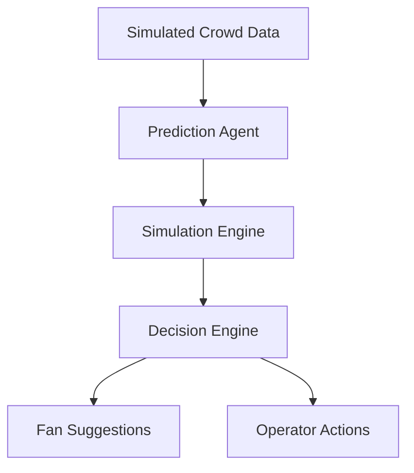

# 🚀 PulseTwin

### Smart AI Decision Intelligence for Crowd Flow Optimization

       

---

## 🌐 🏆 Google AI Studio + Antigravity Virtual PromptWar Submission

---

## 💡 What is PulseTwin?

**PulseTwin is an AI-powered decision intelligence system that predicts crowd behavior, simulates multiple outcomes, and selects the best action to optimize movement and reduce congestion across large-scale environments such as stadiums, airports, malls, concerts, and public events — without requiring any hardware.**

---

## ⚡ Problem

In crowded environments:

- ❌ Long queues  
- ❌ Bottlenecks  
- ❌ Poor crowd distribution  
- ❌ Frustration  

👉 Current systems are reactive and act only after problems occur.

---

## 🔥 Solution

> **Predict 🔮 → Simulate 🧪 → Optimize ⚡**

PulseTwin:
- Predicts congestion in advance  
- Simulates multiple solutions  
- Selects the best action automatically  

---

## 🧠 How It Works

---

## 🎯 Core Features

- 🔮 Predict congestion before it happens  
- 🧪 Multi-scenario simulation  
- ⚡ AI-based decision selection  
- 📊 Real-time dashboard  
- 📉 Reduced wait time & friction  

---

## 📊 Impact

- ⏱️ Reduced waiting time  
- 🔄 Improved crowd flow  
- 😌 Better user experience  
- 💰 Increased operational efficiency  

---

## 🎬 Demo

- 🔴 Before → Crowd congestion  
- 🟢 After → Smooth optimized flow  

👉 One-click **“Optimize”** powered by AI  

---

## 🌍 Use Cases

- 🏟️ Stadiums  
- ✈️ Airports  
- 🛍️ Shopping malls  
- 🎤 Concerts & events  
- 🏙️ Smart cities  

---

## 🛠️ Tech Stack

- React + Tailwind  
- Node.js + Express  
- Gemini API  
- Antigravity (multi-agent system)  

---

## 🚀 Vision

> Build an AI brain for real-world environments that transforms chaos into intelligent flow.

---

## 👨‍💻 Created By

**Samarth Talwar**  

📧 talwarsamarth9@gmail.com  
🔗 https://www.linkedin.com/in/samarthtalwar/  

---

## ⭐ Support

If you like this project:

- ⭐ Star the repo  
- 🚀 Share it  
- 💡 Give feedback  

---

### ⚡ PulseTwin — Predict. Simulate. Optimize.
